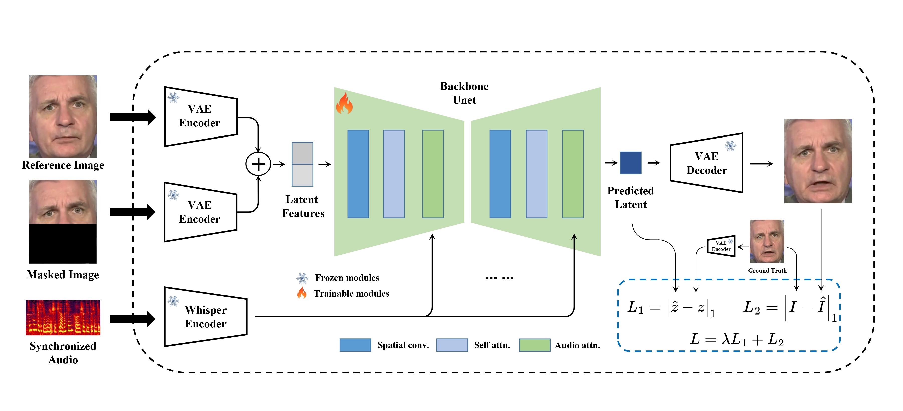

# 🎤 NhepMieng – Nhép Miệng AI SOTA (MuseTalk)

<div align="center">



**Ứng dụng nhép miệng AI thế hệ mới, chạy offline tốc độ cao**  
*Tác giả: Lý Trần · Zalo: 0398029854*

[](https://colab.research.google.com/github/ltteamvn/lip-sync/blob/main/colab.ipynb)
[](https://github.com/ltteamvn/lip-sync)

</div>

---

## 📌 Giới thiệu

**NhepMieng** là ứng dụng nhép miệng (lip-sync) AI mạnh mẽ được xây dựng trên nền tảng **MuseTalk SOTA**, cho phép:

- 🎭 **Nhép miệng tự động** từ ảnh chân dung hoặc video nguồn
- 🎙️ **Chuyển văn bản thành giọng nói** (TTS) tiếng Việt với Edge-TTS
- 🔊 **Sử dụng file âm thanh sẵn có** (MP3, WAV, M4A)
- 🧠 **Làm nét khuôn mặt** tự động bằng GFPGAN
- 💻 **Hỗ trợ GPU (CUDA) và CPU**
- 🖥️ **Giao diện desktop Windows** hiện đại (PyQt5 + FluentUI)
- 🌐 **Giao diện Web UI** chạy trên Google Colab

---

## 🚀 Hai cách sử dụng

### 🖥️ Cách 1: Chạy App Desktop (Windows)

> **Yêu cầu:** Python 3.10/3.11, GPU NVIDIA (khuyến nghị), FFmpeg

```bash
# 1. Clone repo
git clone https://github.com/ltteamvn/lip-sync.git
cd lip-sync

# 2. Cài đặt dependencies
pip install -r requirements.txt

# 3. Tải model weights
python download_musetalk_weights.py

# 4. Chạy ứng dụng
python main.py
```

### 🌐 Cách 2: Chạy trên Google Colab (Miễn phí GPU)

> **Dành cho:** Người không có GPU mạnh tại local

[](https://colab.research.google.com/github/ltteamvn/lip-sync/blob/main/colab.ipynb)

Nhấn badge ở trên để mở trực tiếp trên Google Colab với giao diện Web UI đầy đủ tính năng.

---

## 🖥️ Giao diện Desktop

| Tính năng | Mô tả |
|-----------|-------|
| **Kéo thả ảnh/video** | Hỗ trợ PNG, JPG, MP4, AVI, MOV |
| **TTS tiếng Việt** | Giọng Hoài My (Nữ), Nam Minh (Nam) |
| **Phát video trực tiếp** | Xem kết quả ngay trong ứng dụng |
| **Tuỳ chỉnh nâng cao** | BBox shift, Margin, Parsing mode, Batch size |
| **Log xử lý** | Theo dõi tiến trình theo thời gian thực |

---

## 📋 Yêu cầu hệ thống (Desktop)

| Thành phần | Tối thiểu | Khuyến nghị |
|-----------|-----------|-------------|
| OS | Windows 10 | Windows 11 |
| GPU | Không bắt buộc | NVIDIA ≥ 6GB VRAM |
| RAM | 8 GB | 16 GB |
| Python | 3.10 | 3.11 |
| CUDA | — | 12.1 |

---

## 📁 Cấu trúc thư mục

```
lip-sync/
├── main.py              # App desktop (PyQt5)
├── colab.ipynb          # Notebook Colab Web UI
├── gui_app/
│   ├── generate_page.py # Trang tạo video GUI
│   ├── worker.py        # Luồng xử lý nền
│   └── config.py        # Cấu hình lưu trữ
├── musetalk/            # Core MuseTalk SOTA
├── assets/
│   └── figs/            # Ảnh minh hoạ
├── requirements.txt     # Cho desktop
└── requirements_colab.txt  # Cho Colab
```

---

## 🤝 Đóng góp & Hỗ trợ

Nếu ứng dụng hữu ích với bạn, hãy ủng hộ tác giả để tiếp tục phát triển:

<div align="center">

**💖 Donate qua Momo / VietQR**


**Liên hệ:** Zalo **0398029854** · GitHub [@ltteamvn](https://github.com/ltteamvn)

</div>


---

## ⚠️ Lưu ý

- Mô hình MuseTalk và Whisper **không được đưa vào repo** — chạy `python download_musetalk_weights.py` để tải về
- FFmpeg cần được đặt tại `ffmpeg/ffmpeg.exe` hoặc có trong PATH hệ thống
- Kết quả video được lưu tại thư mục `results/`

---

<div align="center">

*Được xây dựng với ❤️ bởi Lý Trần · 2025*

</div>
